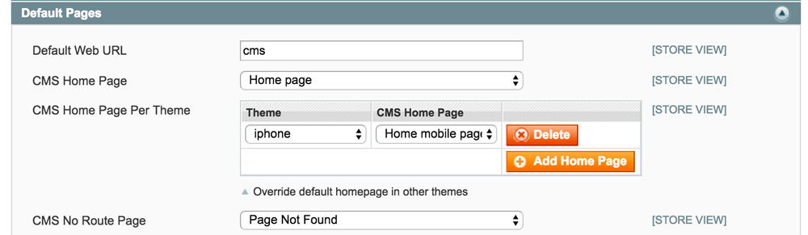

# Magento Homepage Per Theme 

In default Magento you can set a home page on a per store basis.  Sometimes when using browser exceptions for mobile only themes it's useful to set a different homepage. 

This extension allows you to set a homepage for each theme in use. 

Tested against:

- CE 1.9

# Usage

Configure the extension in `System > Configuration > Web > Default Pages > CMS Home Page Per Theme`.

# License

Copyright (C) 2016 Meanbee

This program is free software: you can redistribute it and/or modify it under the terms of the GNU General Public License as published by the Free Software Foundation, either version 3 of the License, or (at your option) any later version.

This program is distributed in the hope that it will be useful, but WITHOUT ANY WARRANTY; without even the implied warranty of MERCHANTABILITY or FITNESS FOR A PARTICULAR PURPOSE.  See the GNU General Public License for more details.

You should have received a copy of the GNU General Public License along with this program.  If not, see <http://www.gnu.org/licenses/>
